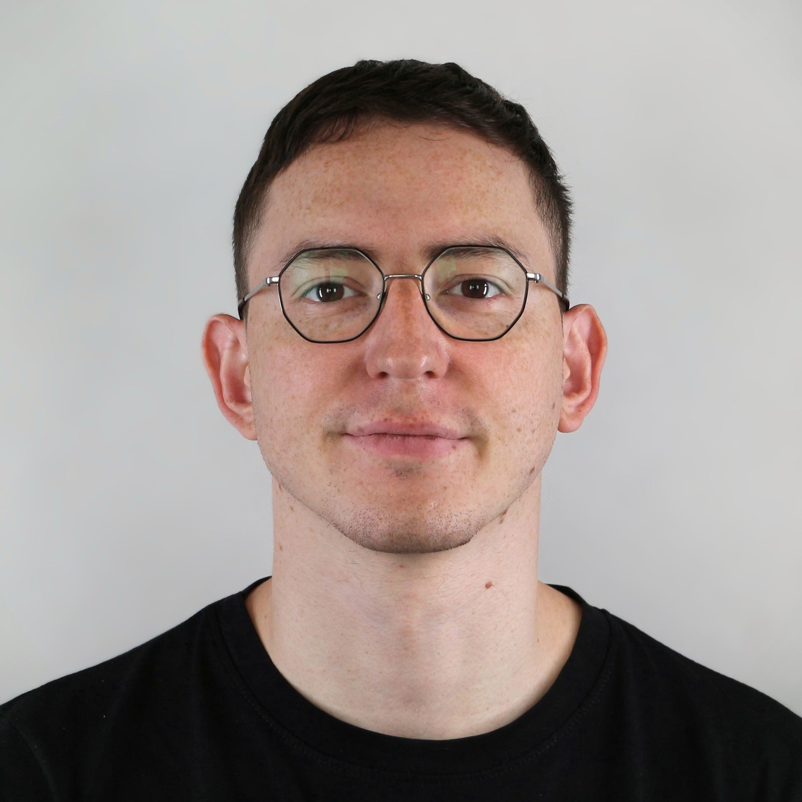

+++
+++
# Marco Abbadini, PhD

I am a Postdoctoral Researcher and Adjunct Professor in Computer Science and Engineering at Università degli Studi di Bergamo. My research work focuses on Computer Security and Privacy but I am interested in many other fields of Computer Science too. 

From October 2024 to March 2025 I've been a visiting PhD Student at IMDEA Software Institute, Madrid (see my [/about](/about) page for more info).

This is a little presentation website of myself and a place to share ideas, posts or articles that I find interesting.

See my academic page at Università degli Studi di Bergamo at [/UNIBG](https://cs.unibg.it/abbadini) and my page at IMDEA at [/IMDEA](https://software.imdea.org/people/marco.abbadini/).

_Do you need any info or do you have any interesting projects to collaborate on? Feel free to contact me: [/contacts](/contacts)_
